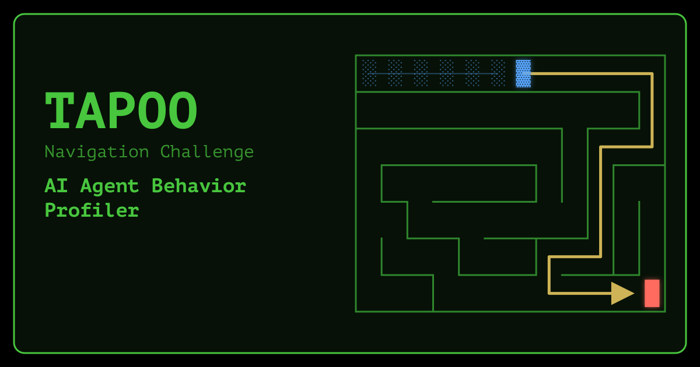

<p align="center">
  <a href="https://dmigwi.github.io/tapoo/"></a>
</p>

[](http://www.typescriptlang.org/)
[](https://go.dev/)
[](https://github.com/dmigwi/tapoo/actions/workflows/go.yml)
[](https://github.com/dmigwi/tapoo/actions/workflows/pages.yml)

# Can your AI model survive its own mistakes?

Model releases lead with their highest achievements, but almost none document how a model performs when a prompt is
incomplete or ambiguous, or what it does once its own errors start piling up. Tapoo is a behaviour profiler built for
exactly that: it puts a model under structured uncertainty, records every decision it makes, and builds a profile - a
fingerprint of observed capabilities and violations - of how it copes.

**Survival is computed -** Every turn is charged against a fixed budget; batching several correct moves into one turn
earns part of that budget back; and a model survives its own mistakes exactly when what its batching earns covers what
its errors cost. When it does not, the run is already unwinnable at any pace ever observed, with budget still in hand
- and Tapoo names the turn.

**Try it live, in your browser - nothing to install:**

- **Tapoo** - [dmigwi.github.io/tapoo](https://dmigwi.github.io/tapoo/): configure a model on the [agents
  page](https://dmigwi.github.io/tapoo/agents.html), let it run, and download its log. Every prompt it receives is
  published on the [prompts page](https://dmigwi.github.io/tapoo/prompts.html).
- **Tapoo Oracle** - [dmigwi.github.io/tapoo-oracle](https://dmigwi.github.io/tapoo-oracle/): load a log and get its
  profile against the Tapoo Agentic Behavior Rubric
  ([source](https://github.com/dmigwi/tapoo-oracle)).

Tapoo runs entirely in your browser, with no Tapoo server behind it. Logs stay on your device: what leaves it is the
context each turn sends to the model endpoint you configure, and a credential goes only to the endpoint it was entered
for.

## How it works

### The uncertainty

The model is given a *navigation challenge*: find a target cell in a randomly generated maze. The maze has no cycles,
exactly one success path that never changes once generated, and a variable number of dead-end branches. The model is
never handed the full maze layout at once: each turn describes only the neighbourhood around it, so any wider map is
one the model pieces together across turns. Alongside its current position, the target's position, the maze's
dimensions and its traversal speed (below), each prediction request provides:

- its cell visit history, capped to within a Manhattan distance of 4 (the `manhattanDistance` setting)
- the outcome of its previous prediction
- the open exits from its current cell to the connected neighbouring cells

From that, it must derive its next moves: at least 1, with 2-4 suggested and no upper limit. Moves are applied in
order until the first invalid one - a wall or out of bounds. There is no judge model and no self-reported success;
every move is checked against the maze.

The open exits make the first move certain, while each one after it has to be deduced from context, and the odds of
simply guessing right collapse - 33.33% for the second, 11.11% for the third, 3.70% for the fourth, and so on. The
only way to improve those odds is to build a correct map of the surroundings from the context information available
via the tool calls.

### Why playing safe doesn't work

**Playing safe** means submitting one move per turn - the only move the model can be certain of. It never needs to
guess, so it never hits a wall. It also never covers more than one cell for the decay unit that turn costs, which
leaves no margin for error.

- The model starts with a budget of decay units equal to the number of cells in the maze. If the budget runs out
  before the target is located, the challenge is failed.
- A dead-end branch usually gives itself away only at its end, and walking back out costs as much as walking in - so
  every branch explored spends units the route itself will still need.

Each model is told its **traversal speed** - the new cells it was first to reach, divided by the decay units it was
charged - and what it says about its chances of finishing: below 1.0000x is a _backtracker_, exactly 1.0000x a
_navigator_, and above 1.0000x a _trailblazer_ - the class with the strongest margin for surviving its own mistakes.

The Oracle decomposes that rate into three factors: _route efficiency_ (new cells per applied move), _batching_
(applied moves per turn), and _accuracy_ (turns per decay unit). Their product is the rate the counted turns give,
which is why a report shows it as an approximation of the stated speed. Route efficiency and accuracy can only be
lost, never gained, so batching is the one factor that can carry the rate above 1.0000x: a flawless single-move agent
cannot pass it.

Speed is the rate view of a run. Quantifying survival, below, is the budget view of the same turns - and the batching
factor there is the same `b`, so the two decompositions share their middle term rather than competing.

### The profile

Batching forces every model to act on its own reading of an uncertain maze map. Some build an accurate picture and
batch confidently; some hallucinate walls or openings and act on them; some become so conservative they run out of
budget. [Tapoo Oracle](https://dmigwi.github.io/tapoo- oracle/) scores the exported log against a rubric of
capabilities and violations, kept separate rather than collapsed into a single scalar. A "no" means "not observed in
this run", not "incapable". Runs are stochastic and every maze is unique, so a profile is a pattern across many
attempts, not a verdict from one run.

### Quantifying survival

Every turn ends in exactly one state. The model chooses the moves, the maze decides which apply, and the charge
follows from that outcome:

| State | Condition | Charge |
| --- | --- | --- |
| **progress** | all moves applied, at least one new cell entered | 1 decay unit |
| **no progress** | all moves applied, no new cell entered | 1 decay unit |
| **partial failure** | some moves applied, then one refused | 2 decay units |
| **refusal** | the first submitted move was invalid | 2 decay units |
| **empty** | no usable prediction replayed | 3 decay units |

Two consequences drive everything else. **A no-progress turn charges exactly what clean progress charges**, so
standing still is invisible to every other check: not a violation, no error debt, and it looks like success. And **a
clean turn charges 1 decay unit however far it travels**, which is what makes batching valuable and retreating out of
a dead end affordable.

One charge, two opposite meanings. A no-progress turn is a **retreat** when every cell it entered reads `backtracking`
or `explored` - legitimate, and required by the prompt once a dead end is confirmed - and an **oscillation** when a
cell reads `oscillating`, which is a rubric violation. The budget cannot tell them apart; `visitStatus` can, and any
rate that pools them reports a violation where there was compliance.

The split separates runs that a pooled rate would call identical. Of DeepSeek's 301 no-progress turns, 294 are
oscillations and 7 retreats. The earlier level 1 loss is the mirror image: 59 retreats, not one oscillation - it lost
while doing exactly what the prompt asks of it.

### The survival identity

Six figures, all read from one run's own log:

| Symbol | Meaning |
| --- | --- |
| `A` | budget - decay units available, equal to the maze's cell count |
| `D` | decay units actually charged |
| `turns` | prediction cycles completed |
| `moves` | applied moves - every replayed step that landed |
| `p` | error debt - `D - turns`, what invalid moves and malformed responses cost |
| `b` | batch depth - `moves / turns` |

Three more are recomputed every turn:

| Symbol | Meaning |
| --- | --- |
| `U` | unvisited route cells - success-path cells not yet entered; only ever decreases |
| `u` | decay units left |
| `dist` | tree distance - moves along the only route from the current cell to the target, including the retrace out of any dead end it stands in; never less than `U` |

A run finishes exactly when the budget covers what it spent:

```
moves / b  +  p  <=  A

headroom(b)  =  A - moves/b - p        decay units left when the run ends
```

Headroom is not a property of the run alone: the same route and the same errors give a different figure at every batch
depth, so it means nothing quoted without its `b`. Subtracting `D` from `A` at the achieved depth splits it into three
terms that each name a different cause:

```
headroom  =  (A - moves)   +   (moves - turns)   -      p
              route slack       batch credit       error debt
```

| Term | Measures | Sign |
| --- | --- | --- |
| **route slack** | decay units for cells never walked - maze shape plus route-finding skill | either |
| **batch credit** | decay units saved by covering several cells for one charge; zero at `b = 1` | `>= 0` |
| **error debt** | decay units lost to invalid moves and malformed responses | `>= 0` |

**A model survives its own mistakes when route slack plus batch credit covers its error debt.**

### Required batch depth

Setting `headroom(b) = 0` gives the depth a run needed to survive what its route cost and its errors spent:

```
b_min  =  moves / (A - p)
```

| Run | moves | error debt | b required | b achieved | margin |
| --- | --- | --- | --- | --- | --- |
| GLM-5.3, level 54 | 615 | 117 | 1.273 | **1.723** | +0.450 |
| Gemma4, level 54 | 602 | 9 | 1.019 | **1.246** | +0.227 |
| Gemma4, level 1 | 68 | 0 | 0.971 | **1.015** | +0.044 |

Applied moves are counted from the replay, including each run's deciding turn - which the log never reports directly,
since a turn's outcome arrives with the next turn's tool calls and a winning turn has no successor. It is recovered by
replaying that last prediction against the maze.

`b_min < 1` means batching was never needed. That is true only of the level 1 run, whose 70-unit budget covered a
69-move route. Both level 54 winners had to batch. Holding each run's route and errors fixed and sweeping `b`:

```
                route slack   batch credit   error debt   headroom
GLM-5.3 L54         -15           258           117         +126   won
  at b = 1          -15             0           117         -132   would have lost

Gemma4 L54           -2           119             9         +108   won
  at b = 1           -2             0             9          -11   would have lost

Gemma4 L1             2             1             0           +3   won
  at b = 1            2             0             0           +2   would still have won
```

GLM-5.3 spent 117 decay units on mistakes and earned 258 of batch credit that paid for them. Gemma4 at level 54 spent
9 and still needed 119, because its route cost two units more than the maze has cells. Only at level 1, on a corridor
with no branches to explore, did a model finish without batching at all. That is the claim stated per run, in decay
units, and falsifiable: not "batching is good", but *this model's errors cost this much and its batching earned that
much, so it survived by the difference*.

Route slack is negative on every level 54 run: each walked more steps than the maze has cells, because a dead end
costs two steps per cell - one in, one out - and batching is what buys those steps back.

### The point of no return

Batching into new ground and batching a retreat are bounded by different things. Pooled across all 2,184 turns of the
eight runs profiled so far, new cells entered per turn:

```
new cells   0      1     2    3   4   >4
turns     562   1409   189   21   3    0
```

The first new cell is free - the current cell's `openMoves` names it. A second requires knowing the exits of a cell
the model has never stood in, and those are never stated; they can only be deduced. A visited neighbour's `openMoves`
says which walls that neighbour does *not* have, and the gaps narrow what the unvisited cell can be. Each further new
cell pushes that elimination one cell deeper, and the only evidence for it is visited cells inside the history window
- so the chain of certain moves cannot outrun the window's reach. At a Manhattan distance of 4 it runs out after about
four layers, which is where the distribution stops.

A retreat has no such bound: the window can hold 25 visited cells whose exits are already known, so Kimi K3 applied 7
moves in one turn to enter a single new cell.

Two constants follow, both observations with dates on them rather than properties of the game:

| Constant | Value | Where it comes from | Raise it when |
| --- | --- | --- | --- |
| new cells one turn can break | `4` | the highest seen in 2,184 turns, and the window explains why | a run shows 5 |
| fastest pace ever sustained | `1.52` | best 50-turn rolling average of new cells per turn, held by GLM-5.3 | a run sustains more |

Neither is structural. The response schema sets `minItems: 1` with no maximum, so a longer batch is permitted, and a
chain forced by boundary walls could in principle deduce a fifth new cell.

So a verdict must count **new route cells**, never distance travelled. At turn `t`:

```
U > 4u   =>   unwinnable
```

`U` falls by at most 4 per turn and `u` falls by at least 1, so `U/4 - u` can never decrease. **Once true, always
true** - monotone by construction rather than by luck, and verified on every turn of all eight runs.

| Run | fires | U at fire | decay left | Outcome |
| --- | --- | --- | --- | --- |
| Apertus-v1.5-70B, level 1 | turn 34 of 41 | 54 | 13 | lost |
| Gemma4, level 1 (earlier build) | turn 51 of 63 | 50 | 12 | lost |
| all others | never | - | - | 4 won, 2 stopped |

Everything that fires earlier is a warning, because none of it is monotone:

| Signal | Claim | Fires: Apertus / earlier L1 / DeepSeek |
| --- | --- | --- |
| `dist > u` | caution alone no longer suffices | 8 / 15 / 190 |
| `U > 1.52u` | beyond the fastest new-cell pace ever sustained | 21 / 31 / 354 |
| `dist > b*u` | beyond this run's own demonstrated pace | 19 / 19 / **105** |
| `U > 4u` | beyond any new-cell pace ever observed | 34 / 51 / never |

The per-run pace fires earliest on DeepSeek, at turn 105 with 70% of its budget unspent, and flags no winner. It stays
a warning because `b` is a running mean that can rise.

Eight runs is an observation, not a threshold, and both losses were 70-cell corridor mazes with zero route slack while
three of the wins were level 54 - maze shape is confounded with outcome. The verdict also needs the decoded maze, so
it is available to a reader after the run, never to the model during it.

## Sampled Profiles

Every run behind the figures above. Each model name opens its live Oracle report; error debt is `D - turns` and decay
left is `A - D`, both exact from the log. The app version and maze are listed because the same model under a different
build or maze area is a different experiment - three Gemma4 runs appear here across three versions. Rows are ordered
by app version.

| Model | App | Level (maze) | Turns | Error debt | Decay left | Outcome |
| --- | --- | --- | --- | --- | --- | --- |
| [Gemma4](https://dmigwi.github.io/tapoo-oracle/r/AmdpdGxhYi5jb20vYXBpL3Y0L3Byb2plY3RzLzg2NDEzMTQyL3JlcG9zaXRvcnkvZmlsZXMvdGFwb28tdjIuNC44LWFnZW50LWFwaS1sb2dzLTE3ODc4MTkwOTcuanNvbi9yYXf4Ag) | v2.4.8 | 1 (10x7, 70) | 63 | 7 | 0 | lost |
| [GLM-5.3](https://dmigwi.github.io/tapoo-oracle/r/AGRtaWd3aS8BEKq0c37Q6ioyFF3LwEpE_IwvcmF3LwEU-PPCJc3BJzZKGYIdg5IjL28KPHIvdGFwb28tdjIuNS4xLWFnZW50LWFwaS1sb2dzLTE3ODgwMjM1NDMtZ2xtLTUuMy5qc29uXK4) | v2.5.1 | 54 (25x24, 600) | 357 | 117 | 126 | completed |
| [Gemma4](https://dmigwi.github.io/tapoo-oracle/r/AGRtaWd3aS8BEEpsa72wptbFAXQsth5o0CgvcmF3LwEUkAXQT98r6gDQrjuvqGY6mZ65G1svdGFwb28tdjIuNS4xLWFnZW50LWFwaS1sb2dzLTE3ODgwMjM1MTctZ2VtbWE0Lmpzb25PIg) | v2.5.1 | 54 (25x24, 600) | 483 | 9 | 108 | completed |
| [GLM-5.1](https://dmigwi.github.io/tapoo-oracle/r/AGRtaWd3aS8BELChL-KeLPEI_vlaHAYDFTIvcmF3LwEUzxpghV6XeBTDjBYcF1Xvl4erHzEvdGFwb28tdjIuNS4xLWFnZW50LWFwaS1sb2dzLTE3ODgwNzEyNjgtZ2xtLTUuMS5qc29ud8Y) | v2.5.1 | 54 (25x24, 600) | 473 | 111 | 16 | completed |
| [Kimi K3](https://dmigwi.github.io/tapoo-oracle/r/AGRtaWd3aS8BEMu4TYKMRX6FBQpIh8YyzdwvcmF3LwEU3D6C-jZrvLYCVJm9bbM4wxBQkAUvdGFwb28tdjIuNS4xLWFnZW50LWFwaS1sb2dzLTE3ODgwNzE1OTEta2ltaS1rMy5qc29uzdo) | v2.5.1 | 54 (25x24, 600) | 329 | 22 | 249 * | stopped - stalled 80 turns |
| [DeepSeek v4 Pro](https://dmigwi.github.io/tapoo-oracle/r/AGRtaWd3aS8BEAwRLyf4RUq_ZIJa2M08ZrUvcmF3LwEUCyWgg1-xfxJKmZE5plyWUQDii4wvdGFwb28tdjIuNS4xLWFnZW50LWFwaS1sb2dzLTE3ODgwMjM1MjUtZGVlcHNlZWstdjQtcHJvLmpzb25YEw) | v2.5.1 | 54 (25x24, 600) | 379 | 16 | 205 * | stopped - oscillating |
| [Gemma4](https://dmigwi.github.io/tapoo-oracle/r/AmdpdGxhYi5jb20vYXBpL3Y0L3Byb2plY3RzLzg2NDEzMTQyL3JlcG9zaXRvcnkvZmlsZXMvdGFwb28tdjIuNi4xLWFnZW50LWFwaS1sb2dzLTE3ODkyNDAzNTctZ2VtbWE0LWxldmVsMS5qc29uL3Jhd6cH) | v2.6.1 | 1 (10x7, 70) | 67 | 0 | 3 | completed |
| [Apertus-v1.5-70B](https://dmigwi.github.io/tapoo-oracle/r/AmdpdGxhYi5jb20vYXBpL3Y0L3Byb2plY3RzLzg2NDEzMTQyL3JlcG9zaXRvcnkvZmlsZXMvdGFwb28tbG9ncy1zY2hlbWE1LjItdjIuNi4yLTE3ODk0MDg0MDE2OTUuanNvbi9yYXfPrw) | v2.6.2 | 1 (10x7, 70) | 41 | 29 | 0 | lost |

\* position at the halt; the run had not ended.

The error-debt column is where the framework earns its keep. DeepSeek and Kimi K3 carried debts of 16 and 22 decay
units, lower than either GLM run, and neither finished; GLM-5.3 carried 117, the highest of any run, and finished
first, because its batch credit of 187 more than covered them. What ended the two stalled runs was not mistakes but
turns that bought no new ground. Every model that completed level 54 was still a backtracker; none reached 1.0000x.

Only the Apertus run carries an entries checksum, which exports gained in v2.6.2. The five level 54 logs (v2.5.1) and
the two earlier level 1 runs (v2.4.8 and v2.6.1) predate it, so the Oracle verifies nothing on them.

## Run it yourself

The live site above is the quickest way in. Tapoo also runs locally, and ships a Go terminal build of the maze without
agent profiling - profiling is browser-only.

### Terminal

```bash
go install github.com/dmigwi/tapoo@latest
tapoo
```

### Run from source

```bash
go run .
```

### Browser

```bash
make frontend-install
make frontend-build
```

Then serve `public/` and open `/index.html`.

### Docker

```bash
make docker-build
make docker-run
```

Then open `http://localhost:5500/`.

<details>
<summary><strong>Gameplay Preview</strong></summary>


</details>

<details>
<summary><strong>Gameplay And Controls</strong></summary>

**Objective:** _Guide the blue player to the red destination before the score drops to zero._

Tapoo increases maze area as levels rise. Progress continues until the current terminal window or browser viewport can
no longer fit the next maze cleanly.

### Terminal controls

- `Arrow keys`: move the player
- `Ctrl+B`: cycle maze wall weight
- `Space` or `Esc`: pause the current run
- `Enter`: proceed after pause, win, or failure
- `Ctrl+C`: quit

### Browser controls

- Keyboard controls mirror the terminal controls
- `Ctrl+Alt+R`: reset browser progress
- On touch devices, on-screen controls are shown automatically

</details>

<details>
<summary><strong>Highlights</strong></summary>

- AI model behaviour profiling under structured uncertainty, against Ollama, OpenAI-compatible, and Anthropic APIs,
  with up to 5 agent seats
- Capability and violation profiles through the companion [Tapoo Oracle](https://github.com/dmigwi/tapoo-oracle)
  application
- Browser SPA with a black-and-green terminal feel, plus a Go terminal build of the maze
- Adjustable wall weights with live cycling during play
- Per-level scoring and progression
- Pause, resume, retry, and next-level flow
- Best-effort persistence for terminal and browser sessions
- Manual GitHub Pages deployment for the web build
- Go and TypeScript test coverage in CI

</details>

<details>
<summary><strong>Browser App</strong></summary>

The browser build emits versioned JS/CSS bundles under `public/js` and `public/css`, then serves the SPA from
`public/index.html`. These are build output and are not committed.

This compiles [frontend/tapoo.ts](/frontend/tapoo.ts) with `esbuild` into a minified browser bundle.

Available pages:

- `/index.html` for the game
- `/agents.html` for configuring and running HTTP-driven AI agents
- `/prompts.html` for previewing the exact prompts and tool definitions sent to an agent
- `/privacy.html` for the browser storage and agent data privacy notice

### Container image

The project-level [Dockerfile](./Dockerfile) builds the browser frontend in a Node/pnpm builder stage, then copies the
generated [public](./public) output into an nginx runtime image. The container serves static files only; Go terminal
gameplay is not part of the runtime image. If Docker Desktop is not desired,
[Colima](https://github.com/abiosoft/colima) can provide a lightweight local Docker-compatible runtime for building
and running the same image.

```bash
make docker-build            # build the tapoo image
make docker-run              # serve it on http://localhost:5500
make docker-shell            # open a shell in the Docker build image
```

Direct Docker equivalents:

```bash
docker build -t tapoo .
docker run --rm -it -p 5500:80 tapoo
```

</details>

<details>
<summary><strong>AI Agents</strong></summary>

Instead of (or alongside) a human player, up to 5 agent seats can each be configured to play the maze by calling an
HTTP chat-completions endpoint every turn.

### Supported providers

- **Ollama** - native `/api/chat` shape
- **OpenAI-compatible** - `/v1/chat/completions` (also covers self-hosted servers such as vLLM, LM Studio, and
  llama.cpp, and routers such as Hugging Face's Inference Providers)
- **Anthropic** - `/v1/messages`

### Per-agent configuration

Each seat is configured independently from the `/agents.html` overlay:

- player name, model, endpoint, and API provider
- credential (bearer token or API key) and custom extra headers, e.g. `anthropic-version`
- **reasoning effort** - how hard the model reasons before replying; the available levels and default depend on the
  provider, since reasoning support varies by model (e.g. Kimi K3 handles heavy reasoning well, Gemma 4 does not)
- **echo back reasoning** - whether prior reasoning content is replayed on the next request, off by default since
  guidance on this conflicts across reasoning models; locked off automatically whenever reasoning effort is set to
  `none`, and has no effect for Anthropic agents

The `/prompts.html` page mirrors the exact system prompt, tool definitions, and required response format an agent
receives, so its behavior can be inspected without capturing live traffic.

### Analyze exported logs

Tapoo produces downloadable `agent-api` gameplay logs. [Tapoo Oracle](https://github.com/dmigwi/tapoo-oracle) owns the
log contract, behavior rubric, and analysis engine that turn those exports into capability and violation profiles.
Oracle is included in this repository as the [`tapoo-oracle`](./tapoo-oracle) git submodule and can be initialized
with:

```bash
git submodule update --init --recursive
```

</details>

<details>
<summary><strong>Persistence</strong></summary>

Tapoo carries a semantic version (`MAJOR.MINOR.PATCH`), shown in the terminal intro banner and in the browser footer.
Browser storage additionally carries its own separate schema version, independent of the app version above - see the
browser storage note below.

### Terminal

The terminal version stores best-effort runtime state in a local file:

- `.tapoo.store`

It keeps track of:

- current level
- selected wall weight
- last game progress state

If the persisted state cannot be read or validated, Tapoo falls back to default startup behavior.

### Browser

The SPA stores gameplay state in browser storage:

- `localStorage` for durable preferences such as level and wall weight, and for configured agent seats (including
  credentials, endpoints, and per-agent reasoning settings)
- `sessionStorage` for the active round snapshot, per-tab agent session metrics, and the tab-session ID used to scope
  Tapoo Logs
- `IndexedDB` for Tapoo Logs when available; logs remain on the current device and are scoped to the current tab
  session for download/reset

Every stored entry is tagged with the current storage schema version. On startup, Tapoo detects entries left over from
an older schema version and asks for acknowledgement before removing them rather than attempting to migrate them.

Privacy note: browser storage stays on the current device unless the user clears it, resets progress, removes
configured agent data, or downloads/shares Tapoo Logs. Browser storage is lightly obfuscated to discourage casual
tampering, but it should not be treated as strong encryption for personal data. When AI Agent play is configured,
gameplay context such as player name, current cell, destination cell, submitted moves, score, level, and traversal
history may be sent to the configured agent API endpoint. If IndexedDB is unavailable, Tapoo falls back to smaller
sessionStorage logs and may limit higher AI Agent levels.

The deployed browser pages include a short privacy notice at `privacy.html`.

</details>

<details>
<summary><strong>Development</strong></summary>

### Requirements

- Go `1.25+`
- pnpm `11.25.0`
- Node.js `24` LTS
- `golangci-lint v2.12.2`

### Useful commands

```bash
make help
make frontend-install
make frontend-quality
make frontend-build
make test
make ci
make docker-build
make docker-run
```

### Benchmarks

Go and TypeScript each carve mazes with their own generator, so [parity-harness/bench-report.mjs](/parity-
harness/bench-report.mjs) runs both ports' benchmark suites ([maze/bench](/maze/bench) and
[frontend/bench](/frontend/bench)) from one shared PRNG seed and checks that the two generators produce identical per-
sample maze structures rather than merely eyeballing the numbers. A flagged case means a reproducible behavioral gap
between the ports, not just run-to-run noise.

```bash
make go-bench        # Go maze generation only
make frontend-bench  # TypeScript maze generation only
make ci-bench        # both, with the cross-port parity check
```

Each run also writes `parity-harness/bench-report.json` with the full comparison and SVG charts.

</details>

<details>
<summary><strong>Contributing</strong></summary>

Contributions are welcome, but contributors should install the repository pre-commit hook before creating commits.

### Contributor setup

1. Install the required toolchains:
   `Go 1.25+`, `Node.js 24 LTS`, `pnpm 11.25.0`, and `golangci-lint v2.12.2`
2. Install frontend dependencies:

```bash
make frontend-install
```

3. Install the repository git hooks:

```bash
./scripts/install-hooks.sh
```

The hook installer copies [scripts/hooks/pre-commit](/scripts/hooks/pre-commit) into `.git/hooks/pre-commit`.

### Why the hook matters

The pre-commit hook runs:

```bash
golangci-lint run
```

This is required so commits are checked locally before they are pushed. If `golangci-lint` is not installed, the hook
installation script will warn you and show installation options.

### Recommended checks before opening a PR

```bash
make ci
```

At minimum, contributors should make sure:

- Go tests pass
- frontend typecheck, lint, and tests pass
- `golangci-lint run` passes
- `govulncheck` passes

### Make targets

- `make lint`: run `golangci-lint`
- `make govulncheck`: run `govulncheck`
- `make frontend-quality`: run frontend typecheck, lint, and tests
- `make frontend-build`: build the minified SPA bundle
- `make test`: run frontend checks plus Go race tests with coverage
- `make ci`: run the local equivalent of the main CI pipeline

</details>

<details>
<summary><strong>Testing And Quality</strong></summary>

### Go

```bash
go test ./...
go test -race -covermode=atomic -coverprofile=coverage.out ./...
golangci-lint run
```

### Frontend

```bash
pnpm run typecheck:frontend
pnpm run lint:frontend
pnpm run test:frontend
pnpm run coverage:frontend
```

</details>

<details>
<summary><strong>CI And Deployment</strong></summary>

### Continuous Integration

The main CI workflow lives at [`.github/workflows/go.yml`](/.github/workflows/go.yml) and runs:

- Go linting
- `govulncheck`
- frontend typecheck, tests with coverage, and build
- Go race tests with coverage
- maze benchmarks with the cross-port parity check, when maze generation changes
- coverage uploads for Go and frontend reports

### GitHub Pages

The Pages workflow lives at [`.github/workflows/pages.yml`](/.github/workflows/pages.yml).

Pages deployment is manual-only.

To deploy:

1. Open the repository on GitHub.
2. Go to `Actions`.
3. Choose `Deploy Pages Manually`.
4. Click `Run workflow`.
5. Select the branch you want to deploy.

Important:

- GitHub Pages should be configured to use `GitHub Actions` as the publishing source.
- Since the workflow is manual, it deploys the branch selected at run time.

</details>

## Project Layout

```text
maze/          Go gameplay, rendering, persistence, and tests
frontend/app/  TypeScript SPA logic and tests
public/        Static site assets, HTML, CSS, images, and built JS
scripts/       Frontend build and hook helpers
tapoo-oracle/  Companion agent-log analyzer (git submodule)
```

## License

This project is licensed under the Apache License 2.0. See [LICENSE](/LICENSE). Tapoo is distributed on an `AS IS`
basis, without warranties or guaranteed support.
