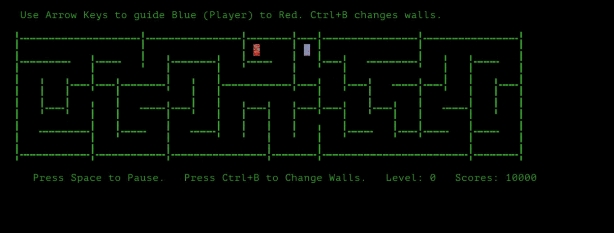

# Tapoo

[](https://github.com/dmigwi/tapoo/actions/workflows/go.yml)
[](https://github.com/dmigwi/tapoo/actions/workflows/pages.yml)
[](https://go.dev/)

Tapoo is a maze runner hide-and-seek game with two interfaces built from the same codebase: a Go terminal game and a browser SPA with the same terminal-inspired feel.

**Objective:** _Guide the blue player to the red destination before the score drops to zero._

## Quick Start

### Terminal

```bash
go install github.com/dmigwi/tapoo@latest
tapoo
```

### Run from source

```bash
go run .
```

### Browser

```bash
make frontend-install
make frontend-build
```

Then serve `public/` and open `/index.html`.

<details>
<summary><strong>Gameplay Preview</strong></summary>



</details>

<details>
<summary><strong>Gameplay And Controls</strong></summary>

Tapoo increases maze area as levels rise. Progress continues until the current terminal window or browser viewport can no longer fit the next maze cleanly.

### Terminal controls

- `Arrow keys`: move the player
- `Ctrl+B`: cycle maze wall weight
- `Space`: pause the current run
- `Ctrl+P`: proceed after pause, win, or failure
- `Esc` or `Ctrl+C`: quit

### Browser controls

- Keyboard controls mirror the terminal controls
- On touch devices, on-screen controls are shown automatically

</details>

<details>
<summary><strong>Highlights</strong></summary>

- Terminal-first maze gameplay
- Browser SPA with the same black-and-green terminal feel
- Adjustable wall weights with live cycling during play
- Per-level scoring and progression
- Pause, resume, retry, and next-level flow
- Best-effort persistence for terminal and browser sessions
- Manual GitHub Pages deployment for the web build
- Go and TypeScript test coverage in CI

</details>

<details>
<summary><strong>Browser App</strong></summary>

The browser build outputs a bundled file at [public/js/tapoo.min.js](/Users/dmigwi/theSecretCoder/App/Golang/src/github.com/dmigwi/tapoo/public/js/tapoo.min.js) and serves the SPA from [public/index.html](/Users/dmigwi/theSecretCoder/App/Golang/src/github.com/dmigwi/tapoo/public/index.html).

This compiles [frontend/tapoo.ts](/Users/dmigwi/theSecretCoder/App/Golang/src/github.com/dmigwi/tapoo/frontend/tapoo.ts) with `esbuild` into a minified browser bundle.

Available pages:

- `/index.html` for the game
- `/agents.html` for the AI Agents placeholder page

</details>

<details>
<summary><strong>Persistence</strong></summary>

### Terminal

The terminal version stores best-effort runtime state in a local file:

- `.tapoo.store`

It keeps track of:

- current level
- selected wall weight
- last game progress state

If the persisted state cannot be read or validated, Tapoo falls back to default startup behavior.

### Browser

The SPA stores gameplay state in browser storage:

- `localStorage` for durable preferences such as level and wall weight
- `sessionStorage` for the active round snapshot

</details>

<details>
<summary><strong>Development</strong></summary>

### Requirements

- Go `1.25+`
- `pnpm 11.7.0`
- Node.js `22`
- `golangci-lint v2.12.2`

### Useful commands

```bash
make help
make frontend-install
make frontend-quality
make frontend-build
make test
make ci
```

</details>

<details>
<summary><strong>Contributing</strong></summary>

Contributions are welcome, but contributors should install the repository pre-commit hook before creating commits.

### Contributor setup

1. Install the required toolchains:
   `Go 1.25+`, `Node.js 22`, `pnpm 11.7.0`, and `golangci-lint v2.12.2`
2. Install frontend dependencies:

```bash
make frontend-install
```

3. Install the repository git hooks:

```bash
./scripts/install-hooks.sh
```

The hook installer copies [scripts/hooks/pre-commit](/Users/dmigwi/theSecretCoder/App/Golang/src/github.com/dmigwi/tapoo/scripts/hooks/pre-commit) into `.git/hooks/pre-commit`.

### Why the hook matters

The pre-commit hook runs:

```bash
golangci-lint run
```

This is required so commits are checked locally before they are pushed. If `golangci-lint` is not installed, the hook installation script will warn you and show installation options.

### Recommended checks before opening a PR

```bash
make ci
```

At minimum, contributors should make sure:

- Go tests pass
- frontend typecheck, lint, and tests pass
- `golangci-lint run` passes
- `govulncheck` passes

### Make targets

- `make lint`: run `golangci-lint`
- `make govulncheck`: run `govulncheck`
- `make frontend-quality`: run frontend typecheck, lint, and tests
- `make frontend-build`: build the minified SPA bundle
- `make test`: run frontend checks plus Go race tests with coverage
- `make ci`: run the local equivalent of the main CI pipeline

</details>

<details>
<summary><strong>Testing And Quality</strong></summary>

### Go

```bash
go test ./...
go test -race -covermode=atomic -coverprofile=coverage.out ./...
golangci-lint run
```

### Frontend

```bash
pnpm run typecheck:frontend
pnpm run lint:frontend
pnpm run test:frontend
pnpm run coverage:frontend
```

</details>

<details>
<summary><strong>CI And Deployment</strong></summary>

### Continuous Integration

The main CI workflow lives at [`.github/workflows/go.yml`](/Users/dmigwi/theSecretCoder/App/Golang/src/github.com/dmigwi/tapoo/.github/workflows/go.yml) and runs:

- Go linting
- `govulncheck`
- frontend typecheck, lint, tests, and build
- Go race tests with coverage
- coverage uploads for Go and frontend reports

### GitHub Pages

The Pages workflow lives at [`.github/workflows/pages.yml`](/Users/dmigwi/theSecretCoder/App/Golang/src/github.com/dmigwi/tapoo/.github/workflows/pages.yml).

Pages deployment is manual-only.

To deploy:

1. Open the repository on GitHub.
2. Go to `Actions`.
3. Choose `Deploy Pages Manually`.
4. Click `Run workflow`.
5. Select the branch you want to deploy.

Important:

- GitHub Pages should be configured to use `GitHub Actions` as the publishing source.
- Since the workflow is manual, it deploys the branch selected at run time.

</details>

## Project Layout

```text
maze/          Go gameplay, rendering, persistence, and tests
frontend/app/  TypeScript SPA logic and tests
public/        Static site assets, HTML, CSS, images, and built JS
scripts/       Frontend build and hook helpers
```

## License

This project is licensed under the Apache License 2.0. See [LICENSE](/Users/dmigwi/theSecretCoder/App/Golang/src/github.com/dmigwi/tapoo/LICENSE).
Tapoo is distributed on an `AS IS` basis, without warranties or guaranteed support.
